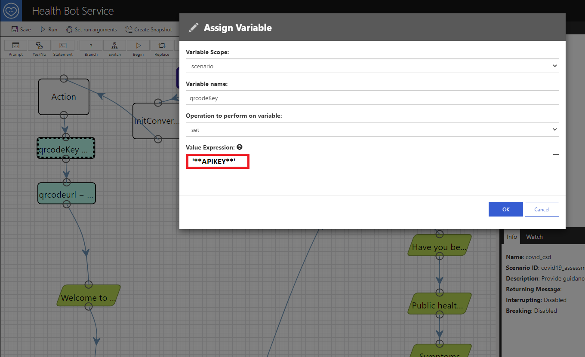
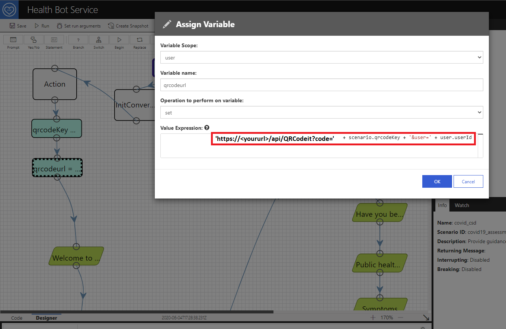

# Chapter 1 - Walkthrough: Implement the sample Azure Functions and call the QRCode Function from a Microsoft Healthbot Service Scenario needing QRCode support

#### This chapter gives and overview of the Azure Functions and how to consume the function(s) to include QRCode functionality.  Also I will show you how to add a few variable assignments and an adaptive card to display the QRCode in the Healthbot Scenario.

## Prerequisites
* Visual Studio
* Microsoft Healthcare bot service instance

#### * csdQRCode Function: Generate a QRCode based on parameters passed in.
#### * covidtoken: Validate a QRCode based lookup and return a pass/fail based on function logic
#### * adaptive card template for displaying the QRCode during chat
#### * example assign variable elements and the adaptive card json to include in your Healthbot scenario

