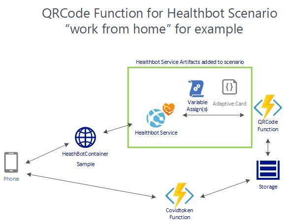

# csdQRCode - Basic Azure Fuctions to enable QRCode creation and handling 

#### This respository contains example code and scenarios demonstrating capabilities of Azure Functions, the Microsoft Healthbot Service, and Adaptive Cards.

The high level solution architecture includes: 
#### * csdQRCode Function: Generate a QRCode based on parameters passed in.
#### * covidtoken: Validate a QRCode based lookup and return a pass/fail based on function logic
#### * adaptive card template for displaying the QRCode during chat
#### * example assign variable elements and the adaptive card json to include in your Healthbot scenario

# Prerequisites
Azure Subscription is required to use these functions as written. These are implemented in .NET Core so you can take the core logic and expose these functions within your own hosting environment.  The adaptive card and action statements are used within the Healthbot Service.

# Contents

* [Chapter 1 - Walkthrough of Solution: Review functions and discuss adaptive card usage](./Chapter1-Walkthrough/README.md)

# Contributing

This project welcomes contributions and suggestions.  Most contributions require you to agree to a Contributor License Agreement (CLA) declaring that you have the right to, and actually do, grant us the rights to use your contribution. For details, visit https://cla.microsoft.com.

When you submit a pull request, a CLA-bot will automatically determine whether you need to provide a CLA and decorate the PR appropriately (e.g., label, comment). Simply follow the instructions provided by the bot. You will only need to do this once across all repos using our CLA.

This project has adopted the [Microsoft Open Source Code of Conduct](https://opensource.microsoft.com/codeofconduct/). For more information see the [Code of Conduct FAQ](https://opensource.microsoft.com/codeofconduct/faq/) or contact [opencode@microsoft.com](mailto:opencode@microsoft.com) with any additional questions or comments.

# Disclaimer 

This sample is provided as-is and is not meant for use in a production environment. It is provided only for illustrative purposes. The end user must test and modify the sample to suit their target environment. 

Microsoft can make no representation concerning the content of this sample. Microsoft is providing this information only as a convenience to you. This is to inform you that Microsoft has not tested the sample and therefore cannot make any representations regarding the quality, safety, or suitability of any code or information found here.   

***

[Go to Chapter 1 - Walkthrough of Solution: Review functions and discuss adaptive card usage](./Chapter1-Walkthrough/README.md)

